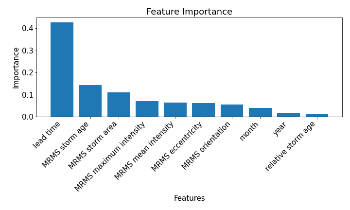

## My Project

I applied machine learning techniques to investigate storm cell displacement errors in the Warn-on-Forecast System.

***

## Introduction 

The Warn-on-Forecast System (WoFS) is a convective-scale rapid-update ensemble data assimilation and prediction system designed to produce probabilistic forecasts of severe weather. While, at present, the National Weather Service releases severe weather watches (forecast-based, on the scale of a few hours) and warnings (observation-based, for presently occurring weather events), the WoFS’s output will enable the implementation of severe weather alerts that are more localized than current watches, yet with longer lead times than current warnings. This could mean the difference between life, severe injury, and even death for many people situated in areas prone to hazardous weather, particularly vulnerable populations in need of more time to move to shelter, such as mobile home residents and hospital patients. Others still are desensitized to severe weather watches, as these can cover multiple states and result in little to no severe weather seen in a given locale, and may only act in response to a warning that could easily come too late. People such as this might be more inclined to take precautions or even move to shelter well in advance if the weather alerts they receive are highly localized. Likewise, emergency services would benefit greatly from localized advance notice, as it is not feasible to fully prepare for severe weather disasters every time a watch is issued, but also not sufficient to prepare a response only once a disaster has begun unfolding (or already unfolded).
Given the value of implementing a system such as the WoFS, it is of course essential that the system is as accurate as possible. However, in comparing WoFS forecasts with Multi-Radar Multi-Sensor System (MRMS) observations made at the forecasts’ valid times, it is clear that there are often displacement errors between predicted storms and observed storms. These storm displacement errors (SDEs) not only impact a forecast’s accuracy but also self-perpetuate across successive forecasts. Furthermore, due to the relatively small scale of individual storms and especially their impacts (for example, the largest tornado on record was 2.6 miles wide, or less than 5 kilometers), even a few kilometers’ difference in a forecast can change its implications. Therefore, it is essential to identify patterns in these SDEs, providing insight into their potential causes and increasing forecast accuracy, or at least allowing compensation for any inaccuracies.
In order to do this, we can analyze paired storm objects using a random forest regressor to identify which factors are most important in predicting SDEs, specifically in storm cells-like objects. We concluded that Total Interest (TI) score is by far the most important in predicting absolute SDE, with a negative correlation. When separating this out, the most important factor is lead time (positive correlation), followed by MRMS mean intensity (negative correlation) and MRMS area (positive correlation). 

## Data

The WoFS uses 36 data assimilation ensemble members and 18 forecast ensemble members, diversified by varying initial and boundary conditions as well as physics schemes combinations. The WoFS produces ensemble forecasts in 30-minute increments with lead times up to 6 hours and outputs every 5 minutes. The forecasts are initialized by assimilating the latest observations, such as radar, satellite, and conventional observations every 15 minutes. Storm objects are identified through object-based analysis of both WoFS and MRMS composite reflectivity analysis, given a minimum intensity threshold and a maximum intensity in exceedance of another threshold. Forecasted and observed storms are then paired using a TI score. We measure SDEs as the absolute distance between matched storm objects’ centroids. 
The dataset used in this project enumerates both WoFS and MRMS attributes of previously identified and paired storm objects, including factors such as month, year, initial time, valid time, lead time, area (km2), eccentricity, mean and maximum intensity (dBz), We also calculate relative storm age as absolute storm age minus lead time, being the age a storm is “now” (at the initialization time) as opposed to the age a storm “will be” (at the valid time). With this metric, a storm can have a negative age if it is projected to form after the initialization time (and does not exist “now”). Storms that may have formed before a WoFS run began have unknown times of formation use the earliest time available for that forecast. With this all in mind, we will be observing the following features: month, year, lead time, storm age, relative age, TI score, MRMS area, MRMS eccentricity, MRMS orientation, MRMS mean intensity, MRMS maximum intensity. In order to narrow down our field of study, we will look only at SDEs of storm cell-like objects. In the interest of submitting on time: for further information on how storm cells are filtered from the dataset (as well as references for information in this report), see my [previous research paper](https://caps.ou.edu/reu/reu23/finalpapers/Lemke-finalpaper.html) on the subject.

## Modelling

Since we are examining features that most highly impact SDEs, we can use a random forest regression model to identify features of importance. Due to the size of the dataset, I only sampled 1% of the data and used a randomized search to find the most optimal hyperparameters for the random forest regression model. Upon applying the model,

I would include code here if I had more time, but I'm submitting the code anyway. I will work on this report more later for my own sake.

## Results and Discussion

{: width="500" }

*Figure 1: Here is a caption for my diagram. This one shows a pengiun [1].*

## Conclusion

I will continue my work over winter break, refining this report and analyzing this output as well as using highly correlating features to produce a rough ridge regression model (as opposed to linear, since there are correlated features) that could potentially be used for bias correction.

[back](./)

